# Connectfy Client - Architectural Analysis

## 1. Overview / Purpose
The Connectfy Client is a robust, highly modular React frontend application (likely built with Vite and TypeScript) for a real-time social/communication platform called "Connectfy". It features instant messaging, friend/relationship management, detailed user profiles, user discovery, comprehensive account and privacy settings, real-time notifications, and various localization/theme features.

## 2. Full Folder Structure
Based on the provided codebase structure, here is the exhaustive directory tree:
```text
connectfy-client/
├── src/
│   ├── assets/
│   │   └── icons/ (MainIcon, NoProfilePhotoIcon, etc.)
│   ├── common/
│   │   ├── api/ (axios.ts, axiosBaseQuery.ts)
│   │   ├── constants/ (apiEndpoints.ts, routet.ts, constants.ts)
│   │   ├── enums/ (enums.ts)
│   │   ├── helpers/ (history.ts, security.events.ts)
│   │   ├── hooks/ (usePresenceHeartbeat.ts, etc.)
│   │   ├── interfaces/ (interfaces.ts)
│   │   ├── types/ (types.ts)
│   │   └── utils/ (checkValues.ts, cropImage.ts, keyboard.ts, keyPressDown.ts, notificationHelpers.ts, routes.ts, skeleton.ts, snackManager.ts, toast.ts)
│   ├── components/
│   │   ├── Card/ (SettingsCard, ToggleCard, UserCard)
│   │   ├── ContextMenu/ (Sidebar)
│   │   ├── Form/ (GenderForm, OTPForm, PhoneNumberForm)
│   │   ├── Loader/ (ComponentLoader.tsx, Loader.tsx)
│   │   ├── Loading/ (Loading.tsx)
│   │   ├── Modal/ (ActionConfirmModal, AuthenticateModal, AvatarModal, CountryCodeModal, DatePickerModal, GlobalModals, SaveChangesModal, SelectionModal)
│   │   ├── Sidebar/ (AuthSidebar, DesktopSidebar, MobileSidebar, UniqueSidebar)
│   │   ├── Skeleton/ (Skeleton.tsx, notification, profile, settings)
│   │   ├── Spinner/ (Spinner.tsx, LoadingSpinner.tsx)
│   │   └── ui/ (CustomButton, CustomCheckbox, CustomInput, CustomTextArea, CustomToast, Select, Typography)
│   ├── context/
│   │   ├── ContextMenuContext.tsx
│   │   ├── SocketContext.tsx
│   │   ├── ThemeContext.tsx
│   │   └── UserContext.tsx
│   ├── hooks/
│   │   ├── useAppNavigation.ts
│   │   ├── useContextMenu.ts
│   │   └── useIsMobile.ts
│   ├── modules/
│   │   ├── auth/ (api, router, types, ui)
│   │   ├── notifications/ (api, hooks, router, types, ui)
│   │   ├── profile/ (api, hooks, router, types, ui)
│   │   ├── settings/
│   │   │   ├── AccountSettings/ (api, router, types, ui)
│   │   │   ├── GeneralSettings/ (api, hooks, router, types, ui)
│   │   │   ├── NotificationSettings/ (api, hooks, router, types, ui)
│   │   │   └── PrivacySettings/ (api, router, types, ui)
│   │   └── users/
│   │       ├── AllUsers/ (api, router, types, ui)
│   │       ├── Blocklist/ (api, router, types, ui)
│   │       ├── MyFriends/ (api, router, types, ui)
│   │       └── UserProfile/ (api, router, types, ui)
│   ├── routes/
│   │   └── router.tsx
│   ├── store/
│   │   ├── store.ts
│   │   └── zustand/
│   │       ├── useAuthStore.ts
│   │       └── useAvatarModalStore.ts
│   ├── styles/
│   │   └── index.css
│   ├── App.tsx
│   ├── global.d.ts
│   ├── i18n.ts
│   ├── main.tsx
│   └── vite-env.d.ts
```

## 3. Architecture & Request/Event Flow

### Step-by-Step Flow
1. **Application Initialization**: `main.tsx` initializes global providers: Redux (`Provider`), custom history mapping (`HistoryRouter`), contextual states (`ThemeProvider`, `UserProvider`, `ContextMenuProvider`), real-time connectivity (`SockerProvider`), and `Toaster`.
2. **Bootstrapping Data & UI**: `App.tsx` handles route matching using `useRoutes()`. It initializes persistent data hooks (`useGeneralSettings`, `useNotificationSettings`, `useNotifications`, `usePresenceHeartbeat`) pulling data from RTK queries.
3. **Authentication & Interceptors**: Axios interceptors in `axios.ts` catch 401s, manage token refreshing via `refreshClient`, use queues for failed requests during a refresh, and trigger a `FORCE_LOGOUT` via `securityEvents` if unrecoverable.
4. **Data Fetching Layer**: RTK Query (`@reduxjs/toolkit/query`) is used for the vast majority of server state management. Features are modularly divided (e.g. `authApi`, `profileApi`). A custom `axiosBaseQuery` adapts Axios to RTK Query syntax.
5. **Real-time Event Flow (WebSockets)**: `SocketContext` instantiates two Socket.IO namespaces: `main` (`/`) and `notification` (`/notification`), providing the `access_token` in `handshake.auth.token` formatted as `Bearer <jwt>`. Socket events drive instant messages and notification toasts (`snackManager`).
6. **Presence & Heartbeat**: `usePresenceHeartbeat` periodically pings `/user/heartbeat` when the app is focused, effectively maintaining user online status.

## 4. ALL Entities/Models (Exhaustive)

### Profile & Account Models
*   `IAccount`: `_id: string`, `userId: string`, `firstName: string`, `lastName: string`, `fullName: string`, `gender: GENDER`, `bio: string | null`, `location: string | null`, `avatar: IAvatar | null`, `defaultAvatar: IDefaultAvatar`, `lastSeen: Date`, `birthdayDate: Date`
*   `IAvatar`: `key: string | null`, `url: string`, `isCustom: boolean`
*   `IUser`: `_id: string`, `username: string`, `email: string`, `phoneNumber: IPhoneNumber`, `isTwoFactorEnabled: boolean`, `timeZone: string | null`, `location: string | null`, `provider: PROVIDER`, `createdAt: Date`, `updatedAt: Date`
*   `IMe` (extends `IUser`): `avatar: IAvatar | null`, `defaultAvatar: IDefaultAvatar`, `language: LANGUAGE`
*   `IDefaultAvatar`: `format: AvatarFormats`, `seed: string`, `url: string`
*   `IEditProfile` (extends `Partial<Omit<IAccount, "_id" | "userId" | "lastSeen">>`): `_id: string`
*   `IEditAvatar`: `_id: string`, `action: ProfilePhotoUpdateAction`, `avatar: IAvatar | null`
*   `IEditDefaultAvatar`: `_id: string`, `format: AvatarFormats`, `useDefaultAvatar: boolean`
*   `ISocialLink`: `_id: string`, `userId: string`, `name: string`, `rank: number`, `url: string`, `platform: SOCIAL_LINK_PLATFORM`, `createdAt: Date`, `updatedAt: Date`
*   `IAddSocialLink`: `name: string | null`, `url: string | null`, `platform: SOCIAL_LINK_PLATFORM`, `userId: string`
*   `IEditSocialLink` (extends `Partial<Omit<ISocialLink, "_id" | "userId">>`): `_id: string`
*   `IUpdateSocialLinkRank`: `links: { _id: string; rank: number; }[]`, `userId: string`
*   `IRemoveSocialLink`: `_id: string`
*   `IRemoveAllSocialLinks`: `_ids: string[]`, `userId: string`
*   `IFindSocialLinks`: `userId: string`, `sort?: Record<string, 1 | -1>`

### Settings Models
*   `IPrivacySettings`: `_id: string`, `userId: string`, `email: PRIVACY_SETTINGS_CHOICE`, `bio: PRIVACY_SETTINGS_CHOICE`, `gender: PRIVACY_SETTINGS_CHOICE`, `location: PRIVACY_SETTINGS_CHOICE`, `socialLinks: PRIVACY_SETTINGS_CHOICE`, `lastSeen: PRIVACY_SETTINGS_CHOICE`, `avatar: PRIVACY_SETTINGS_CHOICE`, `messageRequest: PRIVACY_SETTINGS_CHOICE`, `birthdayDate: PRIVACY_SETTINGS_CHOICE`, `phoneNumber: PRIVACY_SETTINGS_CHOICE`, `friendshipRequest: boolean`, `readReceipts: boolean`
*   `IEditPrivacySettings`: `Partial<Omit<IPrivacySettings, "userId">>`
*   `ITimeZone`: `timeFormat: TIME_FORMAT`, `dateFormat: DATE_FORMAT`
*   `IGeneralSettings`: `_id: string`, `userId: string`, `theme: THEME`, `language: LANGUAGE`, `startupPage: STARTUP_PAGE`, `timeZone: ITimeZone`
*   `IEditGeneralSettings` (extends `Partial<Omit<IGeneralSettings, "userId">>`): `_id: string`
*   `IResetSettings`: `generalSettings: IGeneralSettings`, `privacySettings: IPrivacySettings`, `notificationSettings: INotificationSettings`
*   `INotificationSettings`: `_id: string`, `userId: string`, `notificationSoundMode: NOTIFICATION_SOUND_MODE`, `notificationContentMode: NOTIFICATION_CONTENT_MODE`, `sendMessageSound: boolean`, `receiveMessageSound: boolean`, `privateMessageSound: boolean`, `groupMessageSound: boolean`, `systemNotificationSound: boolean`, `friendshipNotificationSound: boolean`, `showPrivateMessageNotification: boolean`, `showGroupMessageNotification: boolean`, `showFriendshipNotification: boolean`, `showSystemNotification: boolean`
*   `IEditNotificationSettings` (extends `Partial<Omit<INotificationSettings, "userId">>`): `_id: string`

### Account Modification Models
*   `IUpdateUsername`: `username: string | null`, `token: string | null`
*   `IUpdateEmail`: `email: string | null`, `token: string | null`
*   `IUpdatePassword`: `password: string | null`, `confirmPassword: string | null`, `token: string | null`
*   `IVerifyChangeEmail`: `token: string | null`
*   `IUpdatePhoneNumber`: `token: string | null`, `action: PHONE_NUMBER_ACTION | null`, `phoneNumber: IPhoneNumber | null`
*   `IDeleteAccount`: `token: string | null`, `reasonCode: DELETE_REASON_CODE | null`, `reasonDescription: string | null`
*   `IDeactivateAccount`: `token: string | null`
*   `IUpdateTwoFactor`: `token: string | null`, `action: TWO_FACTOR_ACTION`
*   *(Response variants matching their base structures omitted for brevity but they all return exact shapes of `IUser` or `{ statusCode: number }`)*

### Notification Models
*   `INotificationMessage`: `[LANGUAGE.EN]: string`, `[LANGUAGE.AZ]: string`, `[LANGUAGE.RU]: string`, `[LANGUAGE.TR]: string`
*   `IFriendshipNotificationPayload`: `_id: string`, `recipientId: string`, `actorId: string | null`, `type: NotificationType`, `title: INotificationMessage | null`, `body: INotificationMessage | null`, `status: NotificationStatus`, `resourceId: string | null`, `resourceType: string | null`, `metadata: Record<string, unknown> | null`, `readAt: Date | null`, `expiresAt: Date | null`, `createdAt: Date`, `updatedAt: Date`
*   `INotification`: same fields as above but with `actorId: Record<string, any> | string | null` and `channel: NotificationChannel`
*   `IFindNotifications`: `skip: number`, `limit: number`, `status?: NotificationStatus`, `type?: NotificationType`
*   `IMarkAllRead`: `_ids?: string[]`

### Auth Models
*   `ILoginResponse`: `access_token: string`, `language: LANGUAGE`, `theme: THEME`, `startupPage: STARTUP_PAGE`, `isTwoFactorEnabled?: boolean`
*   `ISignupVerifyResponse`: `_id: string`, `access_token: string`
*   `IForgotPasswordResponse`: `statusCode: number`, `email?: string`
*   `ILoginForm`: `identifierType: IDENTIFIER_TYPE`, `identifier: string | null`, `password: string | null`
*   `IPhoneNumber`: `countryCode: string | null`, `number: string | null`, `fullPhoneNumber: string | null`
*   `ISignupForm`: `firstName: string | null`, `lastName: string | null`, `username: string | null`, `email: string | null`, `gender: GENDER | null`, `password: string | null`, `confirm: string | null`, `birthdayDate: Date | null`, `theme: THEME`
*   `ISignupVerifyForm`, `IForgotPasswordForm`, `IResetPasswordForm`, `IGoogleLoginForm`, `IGoogleSignupForm`, `IIsValidToken`, `IRefreshResponse`, `IAuthenticateUser`, `IAuthenticateUserResponse`, `IRestoreAccount`, `IRestoreAccountResponse`, `ICheckUnique`, `ILoginVerifyForm` (Exhaustive scalar fields map directly to endpoints)

### Relationships & Users Models
*   `IFindOneUserResponse`: `user: IFindOneUser`, `profile: IFindOneProfile`, `relationship: IFindOneRelationship`, `actions: { canSendFriendRequest: boolean; canSendMessage: boolean; }`
*   `IFindOneUser`: `_id: string`, `username: string`, `email: string | null`, `phoneNumber: IPhoneNumber | null`, `createdAt: Date`
*   `IFindOneProfile`: `_id: string`, `firstName: string`, `lastName: string`, `fullName: string`, `gender: GENDER | null`, `bio: string | null`, `location: string | null`, `avatar: IAvatar | null`, `birthdayDate: Date | null`, `lastSeen: Date`
*   `IFindOneRelationship`: `friendship: { _id: string; status: FriendshipStatus; userId: string; isFavorite: boolean; isMuted: boolean; } | null`, `count: number`
*   `IFindOneActions`: `canSendFriendRequest: boolean`, `canSendMessage: boolean`, `isBlocked: boolean`, `hasBlocked: boolean`
*   `IFindSocialLinkResponse`: (matches `ISocialLink`)
*   `ISearchUserResult`: `_id: string`, `username: string`, `firstName: string`, `lastName: string`, `fullName: string`, `avatar: IAvatar | null`, `relationship: { _id: string; status: FriendshipStatus; userId: string; friendId: string; } | null`, `friendshipRequest: boolean`
*   `ISearchUsers`: `search: string`, `limit: number`, `skip: number`
*   `IFriendFilters`: `favorite: boolean`, `muted: boolean`
*   `IFriendship`: `_id: string`, `userId: string | Record<string, any>`, `friendId: { _id: string; firstName: string; lastName: string; fullName: string; username: string; avatar: string; }`, `status: FriendshipStatus`, `isFavorite: boolean`, `isMuted: boolean`, `createdAt: Date`, `updatedAt: Date`
*   `IReturnedFriendship`: (matches `IFriendship` with flat string IDs)
*   `IFriendshipRequest`: Similar to `IFriendship` but tailored for requests.
*   `IFindFriends`, `IFindFriendshipRequests`, `ISendFriendshipRequest`, `IAcceptFriendshipRequest`, `IDeclineFriendshipRequest`, `IRemoveFriendship`, `ICancelFriendshipRequest`, `IUpdateCloseFriend`, `IUpdateNotification`. (Exhaustive scalar fields mapped to relationship actions)

## 5. ALL Exposed APIs (Endpoints & Actions)

### External REST API Endpoints (Axios calls & RTK Queries)
#### Auth (`/auth`)
*   `POST /auth/login`
*   `POST /auth/signup`
*   `POST /auth/login/verify`
*   `POST /auth/signup/verify`
*   `POST /auth/forgot-password`
*   `POST /auth/reset-password`
*   `POST /auth/logout`
*   `POST /auth/google/login`
*   `POST /auth/google/signup`
*   `GET /auth/face-descriptor`
*   `POST /auth/is-valid-token`
*   `POST /auth/refresh`
*   `POST /auth/authenticate-user`
*   `POST /auth/restore-account`
*   `POST /auth/signup/verify/resend`

#### User (`/user`)
*   `GET /user/me`
*   `PUT /user/change-username`
*   `PUT /user/change-email`
*   `POST /user/change-email/verify`
*   `PUT /user/change-password`
*   `PUT /user/change-phone-number`
*   `POST /user/check-unique`
*   `PUT /user/two-factor`
*   `DELETE /user/delete-account`
*   `PUT /user/deactivate-account`
*   `POST /user/heartbeat`

#### Account & Settings (`/account`)
*   `GET /account/profile/get`
*   `GET /account/profile/findOneByUserId/:userId`
*   `PUT /account/profile/update`
*   `PUT /account/profile/update-avatar`
*   `PUT /account/profile/update-default-avatar`
*   `POST /account/profile/search`
*   `GET /account/settings/general-settings/get`
*   `PUT /account/settings/general-settings/update`
*   `POST /account/settings/general-settings/reset`
*   `GET /account/settings/notification-settings/get`
*   `PUT /account/settings/notification-settings/update`
*   `GET /account/settings/privacy-settings/get`
*   `PUT /account/settings/privacy-settings/update`
*   `GET /account/social-link/get`
*   `POST /account/social-link/create`
*   `PUT /account/social-link/update`
*   `PUT /account/social-link/update-rank`
*   `DELETE /account/social-link/remove`
*   `DELETE /account/social-link/removeMany`

#### Files (`/files`)
*   `POST /files/presigned-upload`

#### Relationships & Blocklist (`/relationship`)
*   `POST /relationship/friendship/send-request`
*   `POST /relationship/friendship/accept-request`
*   `POST /relationship/friendship/decline-request`
*   `POST /relationship/friendship/cancel-request`
*   `POST /relationship/friendship/unfriend`
*   `PUT /relationship/friendship/update-close-friend`
*   `PUT /relationship/friendship/update-notification`
*   `POST /relationship/friendship/find-friends`
*   `POST /relationship/friendship/find-requests`
*   `GET /relationship/friendship/requests-count`
*   `POST /relationship/friendship/find-online-friends`
*   `POST /relationship/friendship/find-suggestions`
*   `POST /relationship/friendship/find-mutual-friends`
*   `POST /relationship/blocklist/find-blocked`
*   `POST /relationship/blocklist/unblock`
*   `POST /relationship/blocklist/block`

#### Notifications (`/notification-action-history`)
*   `POST /notification-action-history/notification/all`
*   `GET /notification-action-history/notification/countUnread`
*   `POST /notification-action-history/notification/markRead`
*   `POST /notification-action-history/notification/markUnread`
*   `POST /notification-action-history/notification/markAllRead`
*   `DELETE /notification-action-history/notification/remove`
*   `DELETE /notification-action-history/notification/removeAll`

### RTK Query APIs & Redux Environment
- `profileApi`
- `privacySettingsApi`
- `generalSettingsApi`
- `notificationSettingsApi`
- `accountSettingsApi`
- `notificationApi`
- `authApi`
- `userProfileApi`
- `allUsersApi`
- `myFriendsApi`
- `blocklistApi`

### Zustand Stores
- `useAuthStore`: Handles global client-side access tokens and basic auth state.
- `useAvatarModalStore`: Orchestrates complicated avatar creation/editing UI modal flows.

### WebSockets
- Connection points:
  - `main` Socket (`ws://<baseUrl>/`)
  - `notification` Socket (`ws://<baseUrl>/notification`)
- *Note: Emitted/Consumed patterns are handled internally within hooks/components linked to the `SocketsContext`.*

## 6. Core Features
*   **Authentication & Security:** Two-factor authentication, Google OAuth integrations, manual username/email checks, refresh token mechanisms with queued concurrent failure handling.
*   **Deep Customization & Settings:** General Settings (Themes, Languages, Date formats), Privacy Settings (who can see what), and granular Notification controls (sound/content masking).
*   **Detailed Profiles:** Avatars (custom & auto-generated), robust biography systems, ordered/ranked Social Links integrations.
*   **Social & Relationship Engine:** Bi-directional friendship tracking, favorites, muting, comprehensive friend request systems, blocklists.
*   **Real-time Infrastructure:** WebSockets driving online presence (heartbeat intervals), notifications, and message passing.
*   **Global Overlays:** Widespread use of robust Modals (Change Password, Date Picker, Avatar Crop) and Context Menus.

## 7. Technologies Used
*   **Core:** React (Vite environment), TypeScript
*   **State Management:** Redux Toolkit (RTK Query), Zustand (for lightweight local slice state), React Context.
*   **Routing:** React Router v6 (`unstable_HistoryRouter`).
*   **Networking:** Axios (w/ interceptors), Socket.IO Client.
*   **UI / Styling:** Tailwind CSS, Flowbite (for prebuilt Tailwind interactions), Framer Motion (for animations).
*   **Forms & Validation:** likely React Hook Form (implied by complex form designs) & UUID generation.
*   **Utilities:** `react-hot-toast` / `notistack` (snackManager.ts) for notifications, `@react-oauth/google` for authentication logic.

## 8. Implementation Notes / Gotchas
*   **Authentication Tokens via WebSockets**: NestJS gateways on the backend specifically look for the JWT passed in `socket.auth.token` formatted as `Bearer <jwt>`.
*   **Thin-Proxy Refresh**: Axios interceptors push failing unauthenticated requests onto a queue (`failedQueue`) while a refresh is in progress, re-running them all consecutively when the refresh returns (`processQueue()`).
*   **Device Tracking**: A UUID is generated dynamically as a fallback and stored in `localStorage` (`checkDeviceId()`) for distinct device tracking over REST endpoints.
*   **Component Wrapping**: Heavy use of `ComponentLoader` wrapper around `React.lazy` to provide Suspense fallbacks globally to route modules.
*   **Contextual Overlays**: Global modals are rendered at the App root (`<GlobalModals />`) tracking Zustand store values to populate and display dynamically.
*   **Notification Content Masking**: The `notificationHelpers.ts` dictates what content appears in toast popups—users can completely mask body content for privacy when sharing screens.

## 9. Known In-Progress / Partially Implemented Areas
*   **Form Integrations**: Found comments like `// phoneNumber: IPhoneNumber;` inside `ISignupForm` and `IGoogleSignupForm`, implying phone number integration into initial registration is paused or WIP.
*   **Messenger Workflows**: `MESSENGER`, `GROUPS`, and `CHANNELS` are defined in the Enums and sidebar UI, but heavily detailed modules inside `/modules` (like we saw for settings and users) weren't prominently dumped, implying messaging components might be in a different un-dumped structure or heavily WIP.
*   **Face Descriptor**: `FACE_DESCRIPTOR: "/auth/face-descriptor"` hints at an upcoming or WIP biometric login feature (e.g. face ID verification).


## PROJECT IMAGES

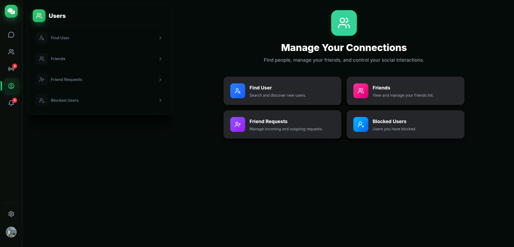
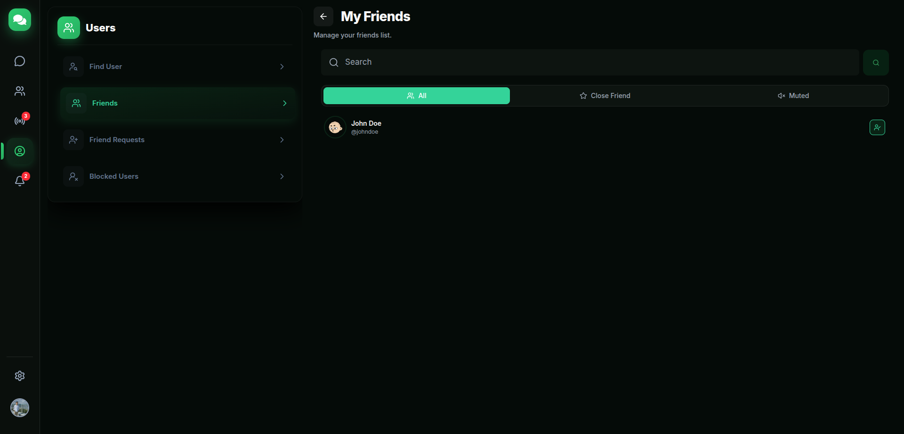
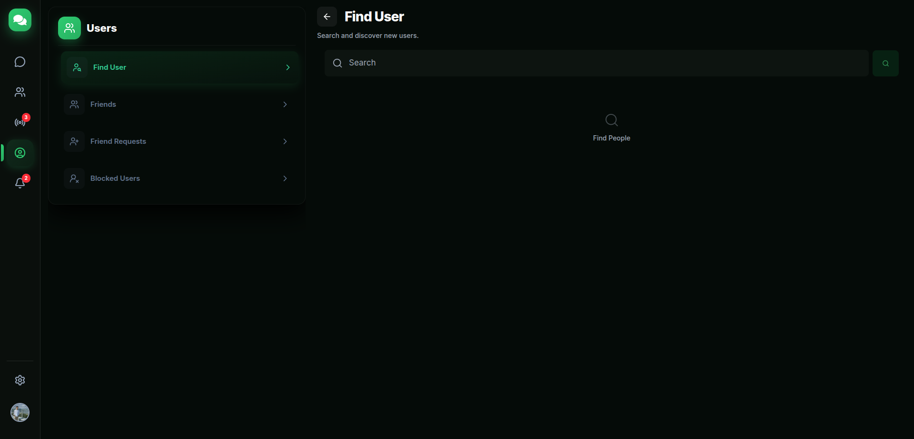
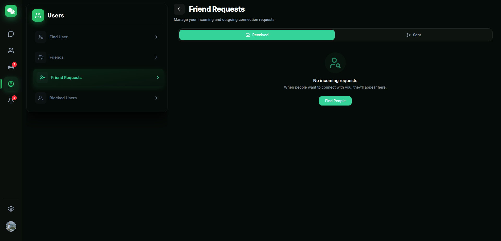
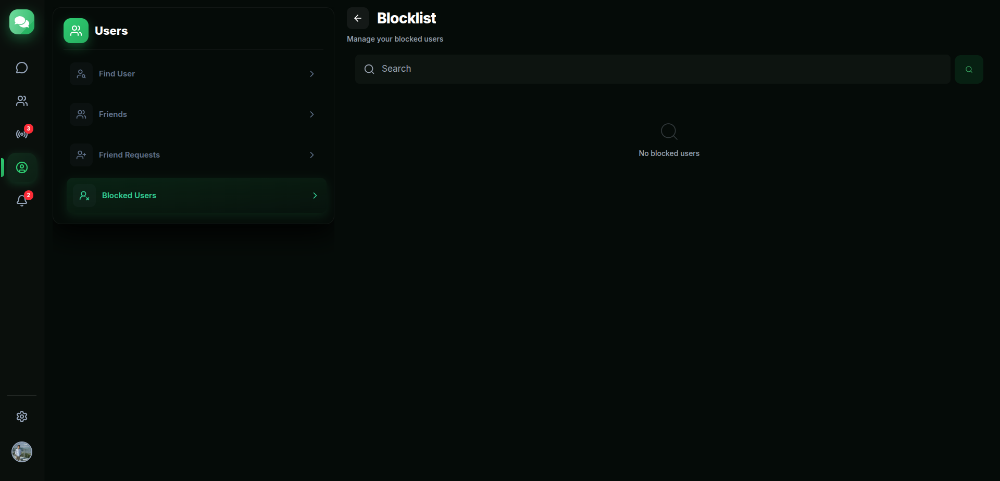
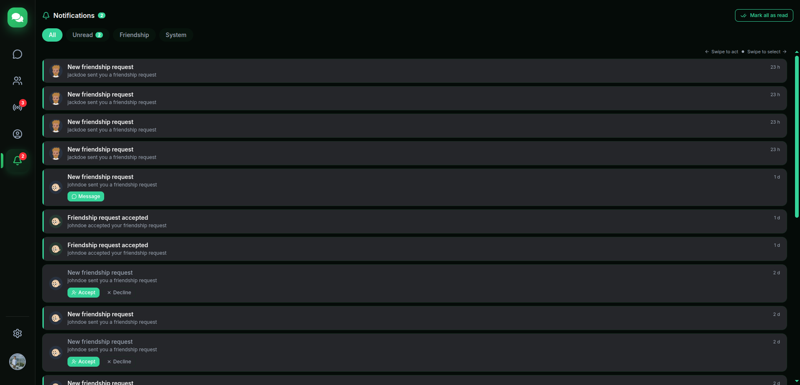
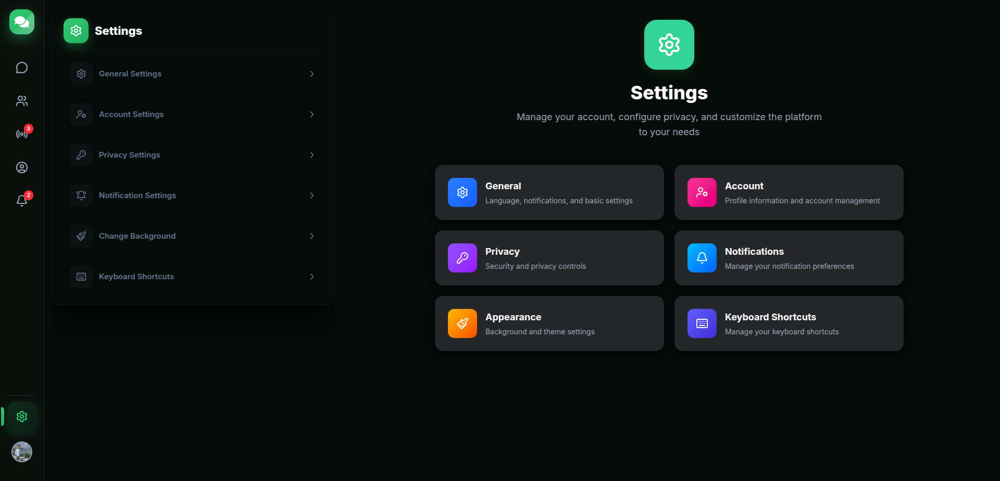
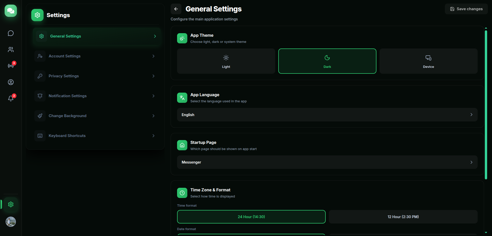
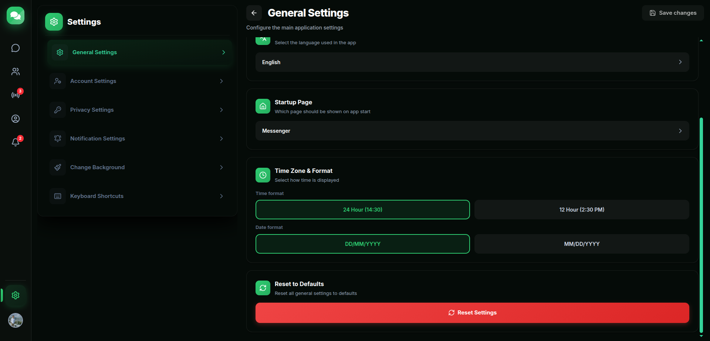
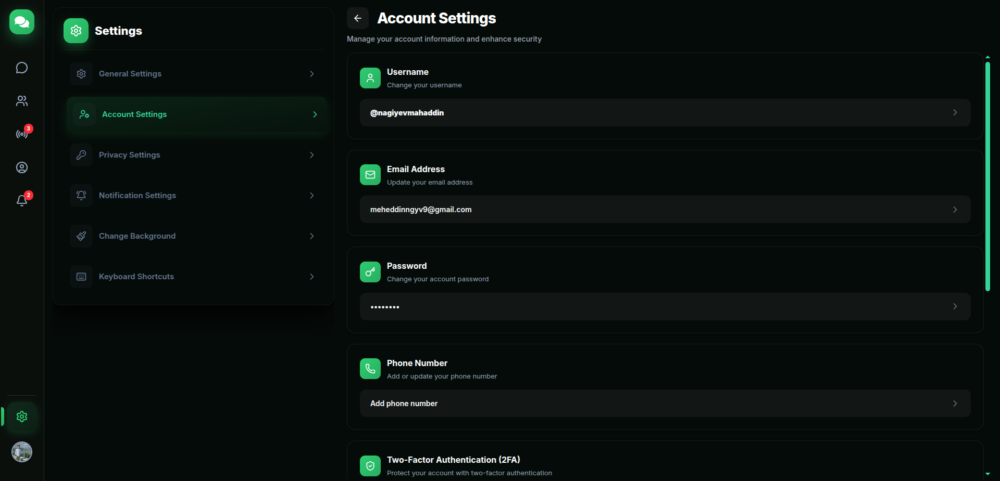
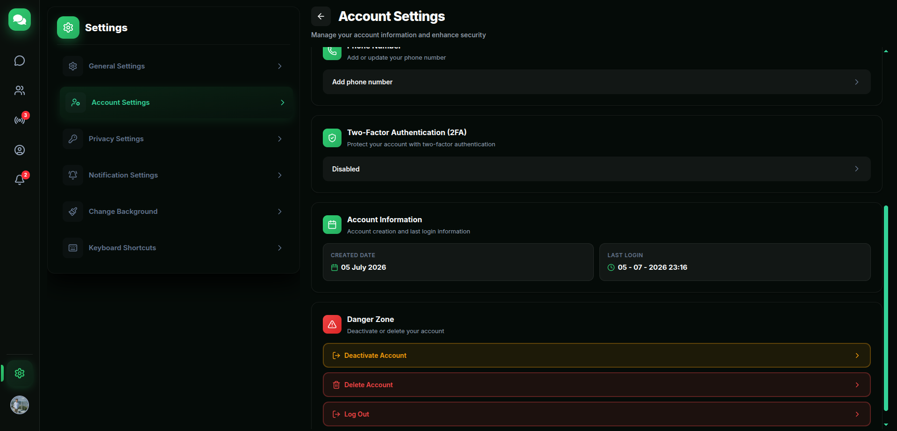
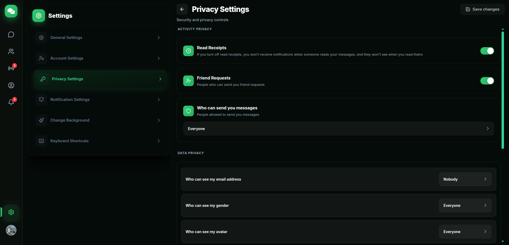
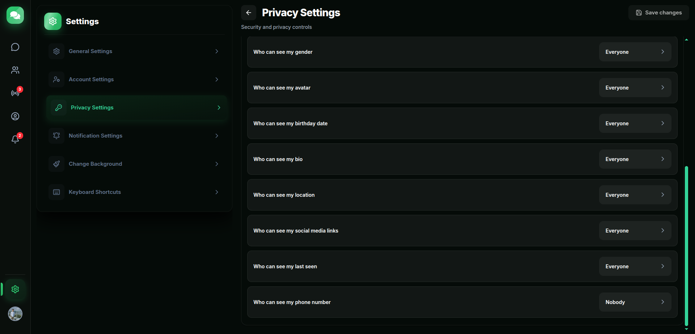
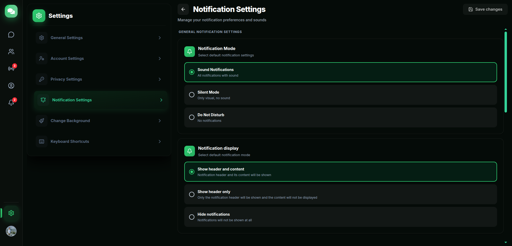
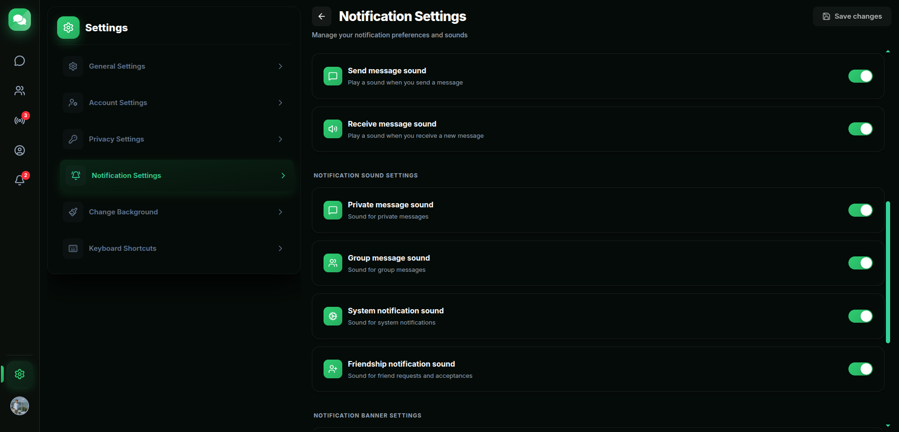
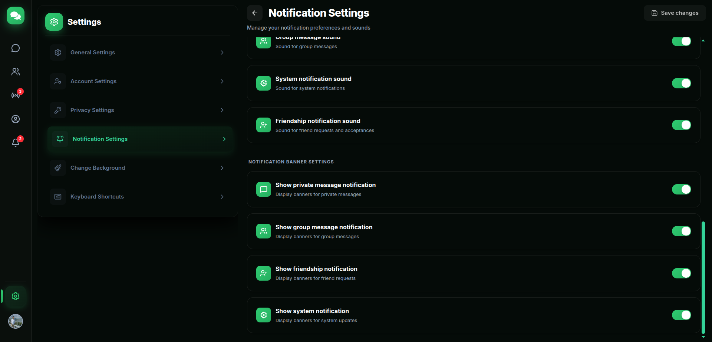
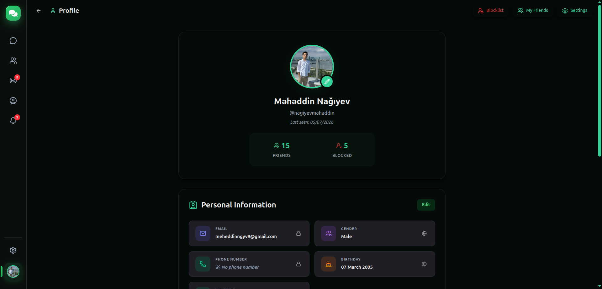
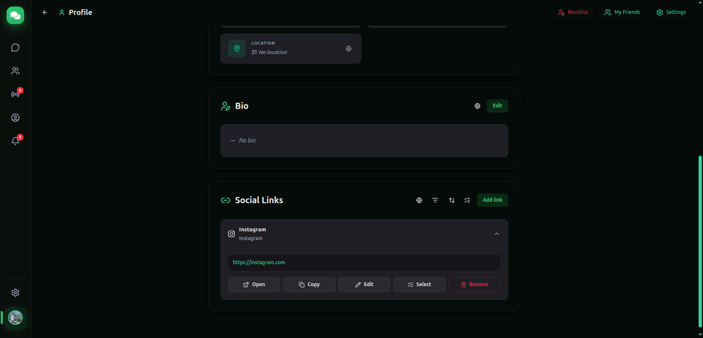
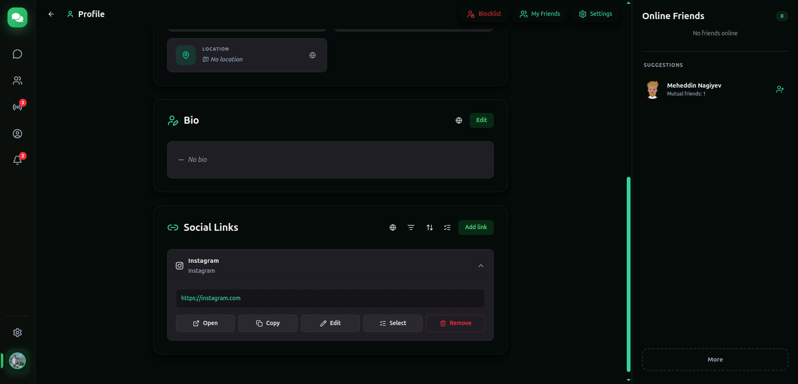
